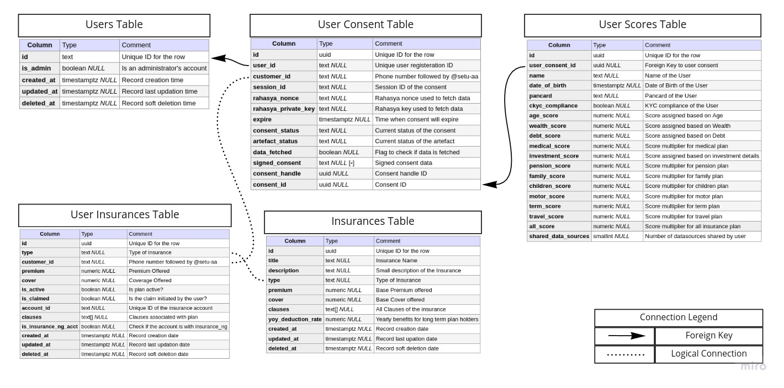

# Insurance NG

Insurance NG is the next generation of insurance service with features like variable premium and cover, quick in-depth analysis of the financial status of a customer using account aggregator framework and much more to outshine the competition.

[Created for the Setu x GitHub Hackathon on Devfolio](https://free-your-data.devfolio.co/).

## Table of Contents

1.  [Features](#features)
2.  [Design](#design)
    -   [Meta workflow](#workflow)
    -   [Backend workflow](#backend-workflow)
    -   [Database](#database)
    -   [FI Types](#fi-types)
3.  [Setup](#setup)
    -   [Configurations](#configurations)
    -   [Development](#development)
4.  [Deployment](#deployment)

## Features

To deliver the next generation of insurance services experience, insurance NG provides the following features:

-   Variable Premiums: We offer lower premiums which adjusts to your lifestyle. If you are a low risk taker, why should your premiums be high?
-   Tailored Dashboard: Don't waste time searching what you want, we will find it for you and provide an experience created uniquely for you.
-   Find Better Plans: Do you have an existing insurance, if there exists a better plan in the category, we will suggest it to you.
-   Clause Discovery: No need to go through 18 pages of terms and conditions, clearly see what's applicable for you and for what you are paying.
-   See the future: Your premiums change with time, see the future predictions for upto 5 years, predicted based on your financial status of the past 5 years.
-   Much more: No long forms, full control on your data, quick and simple user experience etc...

## Design

The application is design with the following major tools:

-   Backend: Golang using mux, websocket, goroutines, channels, go-jwt-middleware, negroni, gorm and [more](./go.mod)...
-   Frontend: React using webpack, axios, react-google-charts, react-router, babel, auth0-react and [more](./package.json)...
-   Authentication: [Auth0](https://auth0.com/)
-   Account Aggregator: [Setu AA](https://docs.setu.co/data/account-aggregator)

### Workflow

We are using 3 docker images: server, nginx and postgres.
The images are connected in the following manner.

**Note:** Click on Image to zoom-in

### Backend Workflow

All the communication with Setu AA (Consent flow and data flow) and triggering the AA workflow is handled in the backend server image.
It also AA data response parsing logic and a websocket endpoint that reports when the data is ready.
The workflow for server image is as followed:

**Note:** Click on Image to zoom-in

### Database

We have 5 tables the store the following information:

1.  User Table: Stores basic information about user when they register.
2.  User Consent Table: Stores AA consent details created by the user.
3.  User Scores Table: Stores the scores calculated as per their habits and lifestyle based on FIP data.
4.  User Insurance Table: Stores information about insurances that are purchased by the user.
5.  Insurance Table: All Insurances offered by Insurance NG.

**Note:** Click on Image to zoom-in

### FI Types

**Note:** Click on Image to zoom-in

## Setup

The following section discusses how to setup Insurance NG in your system.

### Configurations

Create a copy of the `.env.example` file and rename it to `.env`.
Now, we can manipulate the following variables to configure the application.
You can find example values in the `.env.example` file itself.

| Key                          | Description                                                              |
| ---------------------------- | ------------------------------------------------------------------------ |
| DB_USER                      | PostgreSQL User                                                          |
| DB_PASS                      | PostgreSQL Password                                                      |
| DB_NAME                      | Database Table Name                                                      |
| DB_PORT                      | Database Port                                                            |
| DB_HOST                      | Database Host/Domain                                                     |
| APP_PORT                     | Port at which our backend will Run                                       |
| APP_CORS                     | Allowed CORS for backend                                                 |
| APP_SETU_AA_ENDPOINT         | Setu AA URI                                                              |
| APP_SETU_CLIENT_KEY          | Setu Client Key                                                          |
| APP_SETU_AA_KEY              | Setu AA Key                                                              |
| APP_SETU_JWS_PRIVATEKEY_PATH | Path to the private key used for JWS (Public key shared with Setu)       |
| REACT_APP_PORT               | Port at which react find server (separate var helpful for reverse proxy) |
| REACT_CORS                   | CORS allowed from React End                                              |
| AUTH0_DOMAIN                 | Auth0 Application Domain                                                 |
| AUTH0_CLIENT_ID              | Auth0 Application Client ID                                              |
| AUTH0_REDIRECT_URI           | Auth0 redirect after login (eg. <http://localhost:8010/register>)        |
| AUTH0_LOGOUT_URI             | Auth0 redirect after logout (eg. <http://localhost:8010>)                |
| AUTH0_JWT_WELKNOWNS_PATH     | Auth0 JWKs file (eg. content of `<your-domain>/.well-known/jwks.json`)   |
| DEBUG                        | Application Shows detailed logs when set to True                         |

### Development

If you want to setup insurance NG in your machine for development, please follow
these steps.

#### Prerequisites

-   golang
-   node
-   mpm | yarn
-   docker
-   docker-compose

#### Setup Steps

1.  Create a copy of the `.env.example` file and rename it to `.env`.
2.  Create an application on Auth0 and get values for `AUTH0_*` environment variables.
3.  [Follow the setu guide](https://docs.setu.co/data/account-aggregator/bridge-integration) to create an application on the bridge and get the values for `APP_SETU_AA_ENDPOINT`, `APP_SETU_CLIENT_KEY`, `APP_SETU_AA_KEY` and `APP_JWS_AA_PRIVATEKEY`.
4.  Install react dependencies: `npm install`
5.  Install golang dependencies: `go mod tidy`
6.  Start database: `npm run docker-db`
7.  Run the react application: `npm run react-start`
8.  On a different terminal, start server: `npm run server`
9.  When you are done making your changes, push the new docker images: `docker push <user>/insurance-ng`

## Deployment

To deploy the insurance ng, do the following:

1.  Copy your `.env`, `deploy/` and `docker-compose.yml` to your server.
2.  Copy your `private.pem` (private key for which the public key is shared with Setu) inside the `deploy/` folder on the server.
3.  Generate dhparam certificates `openssl dhparam -out ./deploy/nginx/dhparam.pem 2048`
4.  Generate SSL certs using certbot certificates:
    -   Follow [certbot instructions](https://certbot.eff.org/instructions).
    -   Copy fullchain: `sudo cat /etc/letsencrypt/live/<domain>/fullchain.pem > ./deploy/nginx/fullchain.pem`
    -   Copy privkey: `sudo cat /etc/letsencrypt/live/<domain>/privkey.pem > ./deploy/nginx/privkey.pem`
5.  Run `docker-compose pull`
6.  Run `docker-compose up -d db server nginx`
7.  When the images are up, check your IP address, the application should be accessible.

## Licenses

-   The site [favicon of the website](https://commons.wikimedia.org/wiki/File:ALiAS_Logo.png) is contributed by [Parth Sharma](https://twitter.com/parthshar2) under **CC BY-SA License** on WikiMedia.
-   The open-source libraries used have their own seperate licenses. Most of them are under MIT license. Please check the license for [golang dependencies' licenses](./go.mod) and [react dependencies' licenses](./package.json) before using the project for your purposes.
